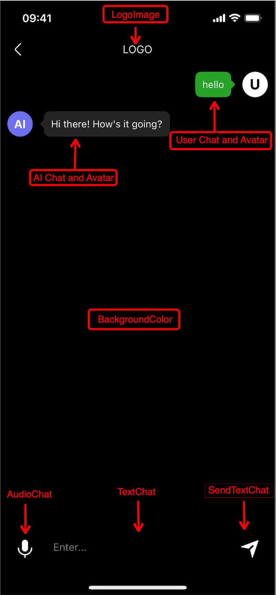

# AIChatBotiOSSPM

## Xcode configuration

1.Creating a Swift Project

2.Minimum project version: 15.0

3.Add privacy permission requests in Target –> Info:

  Privacy - Microphone Usage Description
  
  We need access to your microphone to record audio.

## Installation

Xcode --> File --> Add Package Dependencies... --> Serch: https://github.com/fuwei007/AIChatBotiOSSDKSPM.git --> Add Package


## Usage


1.Import the header file at the top of the file where the chat interface will be displayed:
```ruby
import AIChatBotiOSSPM
```

2.OpenAI available App Key (required):
```ruby
ChatVCDefaultSetManager.shared.your_openAI_Appkey = "*******"
```

3.Initialize parameters (optional):

  3.1.Page color
  ```ruby
  ChatVCDefaultSetManager.shared.backgroundColor = .black
  ```
  
  3.2.Show logo
  ```ruby
  ChatVCDefaultSetManager.shared.isShowLogo = true
  ChatVCDefaultSetManager.shared.logoImage = UIImage(named: "***")
  ```
  
  3.3.User avatar
  ```ruby
  ChatVCDefaultSetManager.shared.userAvatarImage = UIImage(named: "***")
  ```
  
  3.4.AI avatar
  ```ruby
  ChatVCDefaultSetManager.shared.AIAvatarImage = UIImage(named: "***")
  ```
  
  3.5.Support for real-time voice chat
  ```ruby
  ChatVCDefaultSetManager.shared.isSupportAudioRealTimeChat = false
  ```
  
  3.6.Clear local chat history (clear previous chat data when entering the chat interface)
  ```ruby
  ChatVCDefaultSetManager.shared.isClearLocalChatMessagesData = true
  ```
  
  3.7.Clear remote chat history (whether to send historical chat data to OpenAI each time connecting to the OpenAI server)
  ```ruby
  ChatVCDefaultSetManager.shared.isClearOpenAIChatMessagesData = true
  ```
  
  3.8.Modify the sound effect type of voice chat. [OpenAI Voice options](https://platform.openai.com/docs/guides/text-to-speech#voice-options)
  ```ruby
  ChatVCDefaultSetManager.shared.chatAudioVoiceType = "ash"
  ```
  
  3.9.Set the model type for connecting to OpenAI.[OpenAI Model options](https://platform.openai.com/docs/guides/realtime#get-started-with-the-realtime-api)
  ```ruby
  ChatVCDefaultSetManager.shared.RealtimeAPIGPTModel = "gpt-4o-mini-realtime-preview-2024-12-17"
  ```
  
  3.10.You can fully customize the session’s configuration statement. Once you set this content, optional parameters will become invalid.
  ```ruby
  var sessionConfigurationStatement = [String: Any]()
  sessionConfigurationStatement[""] = ""
  ChatVCDefaultSetManager.shared.sessionConfigurationStatement = sessionConfigurationStatement
  ```
  
  3.11.Select the technology option for real-time calls, with WebSocket mode as the default. (WebSocket/WebRTC)
  ```ruby
  ChatVCDefaultSetManager.shared.typeOfConnectGPT = "WebSocket"
  ```
  
4.FunctionCall related:

  4.1.Example 1：Change the background color of the chat interface.
  
  (1).Add FunctionCall
  ```ruby
  var functionCallProperties = [[String: Any]]()
  let functionCallProperty1: [String: Any] = [
    "property_name": "color",
    "property_type": "string",
    "property_description": "This is a required parameter, used to set the page background color. When returning the parameter, please return its hexadecimal value.",
    "property_isRequired": true
  ]
  functionCallProperties.append(functionCallProperty1)
  ChatVCDefaultSetManager.shared.addFunctionCall(functionCallName: "changeChatViewcontrollerBackgroundColor", functionCallDescription: "Change the background color of the chat interface", functionCallProperties: functionCallProperties)
  
  //Convert hexadecimal color string to UIColor
  func converHexToColor(hex: String) -> UIColor? {
    var hexSanitized = hex.trimmingCharacters(in: .whitespacesAndNewlines)
    if hexSanitized.hasPrefix("#") {
        hexSanitized.remove(at: hexSanitized.startIndex)
    }
    if hexSanitized.count == 6 {
        var rgb: UInt64 = 0
        Scanner(string: hexSanitized).scanHexInt64(&rgb)
        let red = CGFloat((rgb & 0xFF0000) >> 16) / 255.0
        let green = CGFloat((rgb & 0x00FF00) >> 8) / 255.0
        let blue = CGFloat(rgb & 0x0000FF) / 255.0
        return UIColor(red: red, green: green, blue: blue, alpha: 1.0)
    }
    return nil
  }
  ```
  
  (2).Trigger FunctionCall
  ```ruby
  ChatVCDefaultSetManager.shared.handleFunctionCallFromSDK = {functioncall_message in
    //print("functionCall_ReturnData:\(functioncall_message)")
    guard let name = functioncall_message["name"] as? String else{return}
    if name == "changeChatViewcontrollerBackgroundColor",
    let arguments = functioncall_message["arguments"] as? [String: Any],
    let color_hex_string = arguments["color"] as? String{
      //Change Chat Page BackgroundColor
      if let color = self.converHexToColor(hex: color_hex_string){
        DispatchQueue.main.async {
            ChatVCDefaultSetManager.shared.currentChatVC.view.backgroundColor = color
        }
      }
    }
  }
  ```
  
  4.2.Example 2: Calculate the sum of two numbers.
  
  (1).Add FunctionCall
  ```ruby
  var functionCallProperties = [[String: Any]]()
  let functionCallProperty1: [String: Any] = [
      "property_name": "number1",
      "property_type": "string",
      "property_description": "This is the first number to be added. This data must be obtained. If this parameter is missing, please ask me: What is the first number?",
      "property_isRequired": true
    ]
  let functionCallProperty2: [String: Any] = [
    "property_name": "number2",
    "property_type": "string",
    "property_description": "This is the second number to be added. This data must be obtained. If this parameter is missing, please ask me: What is the second number?",
    "property_isRequired": true
    ]
  functionCallProperties.append(functionCallProperty1)
  functionCallProperties.append(functionCallProperty2)
  ChatVCDefaultSetManager.shared.addFunctionCall(functionCallName: "thisAddFunction", functionCallDescription: "Please perform addition. Both parameter numbers must be obtained. Once both numbers are retrieved, please directly return their sum.", functionCallProperties: functionCallProperties)
  ```
  
  (2).Trigger FunctionCall
  ```ruby
  ChatVCDefaultSetManager.shared.handleFunctionCallFromSDK = {functioncall_message in
      //print("functionCall_ReturnData:\(functioncall_message)")
      guard let name = functioncall_message["name"] as? String else{return}
      if name == "thisAddFunction",
          let arguments = functioncall_message["arguments"] as? [String: Any],
          let number1 = Float(arguments["number1"] as? String ?? ""),
          let number2 = Float(arguments["number2"] as? String ?? ""){
          print("\n number1=\(number1),number2=\(number2)\n result=\(number1+number2)")
      }
  }
  ```
    
5.Navigate to the chat interface (required):
  ```ruby
  ChatVCDefaultSetManager.shared.showChatVC(fromVC: self)
  ```
  
## Specific usage video

Open AI Realtime API iOS SDK | Fully open source | Swift code available on GitHub | Cocoa pod [YouTube](https://youtu.be/3HC1VeaPhRo)

## Related Projects

If you want to learn more about AI or chat-related projects, you can check out my other project.[OpenAIIOSRealtimeAPIDemo](https://github.com/fuwei007/OpenAIIOSRealtimeAPIDemo)

## Author

Frank Fu, fuwei007@gmail.com


